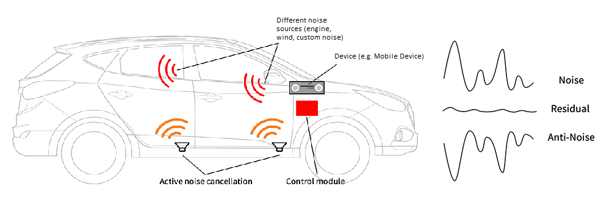

# 🎧 Adaptive Active Noise Cancellation 🎧

--- 




_Active Noise Cancellation_ **(ANC)** system for automobile passengers. The system is a prototype based on deep neural network technology that aims to produce the Anti-Noise signal to make the noise more silent inside the car. The goal of the project is to help car drivers enjoy a comfortable ride without any interference or disruptions. 

[The System Design Documenation.](./discovery/designdoc/System_Design.md)

### 🌟 **Introduction**
Noise is everywhere. From the hum of city streets to the chatter of crowded rooms. But what if you could control that noise, or better yet, eliminate it? Enter Adaptive Active Noise Cancellation – your shield against unwanted ambient sounds.


---

### 📖 **Project Overview**

**Active Noise Cancellation (ANC)** is not just about blocking out noise. It's about creating a symphony of silence amidst the chaos. This project seeks to push the boundaries of what's possible with ANC, crafting a dynamic solution that dances to the ever-changing tune of the world's noises.

🔹 **Real-time Noise Analysis:** Like an ever-watchful sentinel, process and analyze ambient noise on-the-go, paving the way for perfect silence.

🔹 **Adaptive Algorithm Implementation:** Adapt. Evolve. Overcome. Harness the power of algorithms that change as the world does, offering unparalleled noise control.

🔹 **Performance Evaluation:** Silence is golden, and we aim to prove it. Assess the majesty of the noise cancellation across varied conditions, ensuring perfection.

---

### 🛠 **Technologies**

- **Language:** Python 🐍, C/C++ 
  

- **Libraries/Frameworks:** 
  - 🧠 **PyTorch** 
  - 🔢 **NumPy /Scipy / StatsModels**
  - 🎵 **SoundDevice / Librosa / ffmpeg**
  - 🧠 **FastAPI**
  - 🔢 **Docker**


- **Hardware:** 
  - 🎤 **Microphone Array**
  - 🔊 **Speakers**


- **Collaborative Tools:** Git & GitHub 🚀

---

### 🔢 Dataset:

Now we are collecting ambient sound dataset from open source platforms (e.g. YouTube).

To download dataset you have file `ids.csv` under directory:
```./src/datasources/youtube_ids/ids.csv```

In order to get audio batches by provided duration per batch you need to run the following script:

``` Python
python ./utils/data/data_parser.py --file_with_ids ./src/datasources/youtube_ids/ids.csv --save_to ./dataset/batches/ --source youtube --audio_format wav --batch --batch_seconds 120
```

---

### TODOs:
For further exploration, setup instructions, and contributions.

---

### Developers:


----