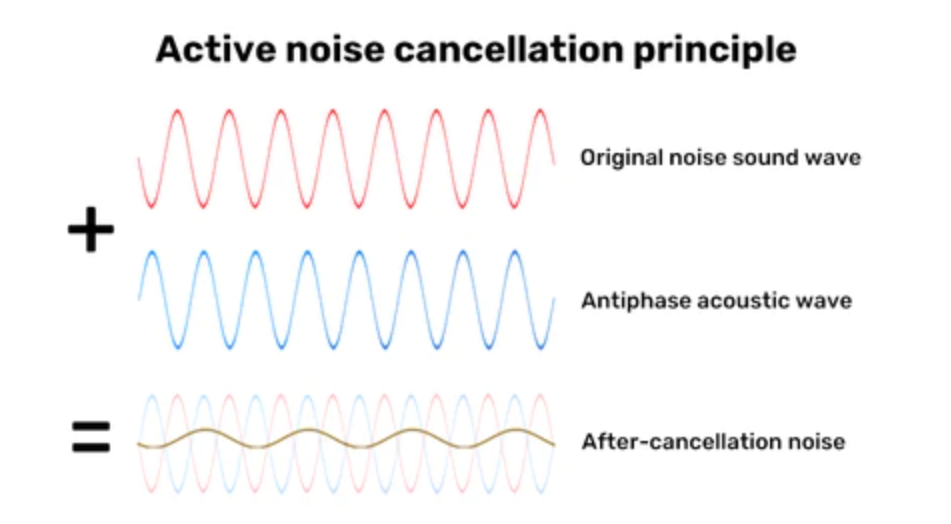
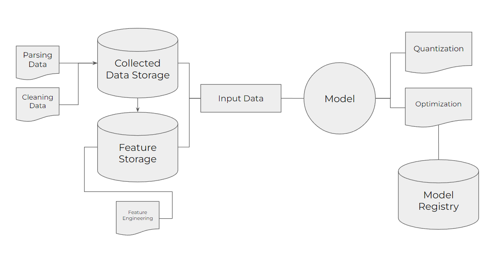
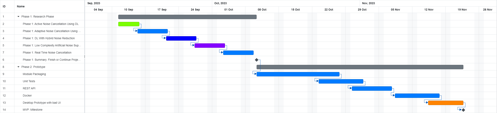

# _AANC System Design Documentation_

---

# Content:
1. [Overview.](#1-overview)
2. [Motivation.](#2-motivation)
3. [Success Metrics.](#3-success-metrics)
4. [Requirements and Constraints.](#4-requirements-and-constraints)
5. [Methodology.](#5-methodology)
6. [Implementation.](#6-implementation)
7. [WorkFlow and Time Horizons](#7-workflow-and-time-horizons)

 

---

# 1. Overview:

The Adaptive Active Noise Cancellation (AANC) project tries to revolutionize noise cancellation approach in the car manufacturing industry. Traditionally, car manufacturers invest significant amount of money in hardware solutions (e.g. the overpriced microcontrollers that form the noise cancellation system inside the car) to insulate passengers from external noise, which can average between **70 to 80 dBs** during the highway drives.

Our solution offers a modern technical approach by leveraging machine learning algoritms within a mobile (or desktop) application. No additional equipment is needed, only a mobile phone and the car's audio system. Passengers can simply connect their phones to the car's audio system and activate the AANC app. The application, using our developed neural network, assesses the ambient noise and sends an anti-signal to counteract the noise, aiming to reduce the in-car levels to more **comfortable 30 to 40 dBs**, enhancing the in-car drivers experience.

---

# 2. Motivation:

The automobile industry has seen an exponential growth not just in the number of vehicles produced, but also in the expectations of consumers. As urbanization intensifies and roads become busier, the challenge of maintaining a tranquil in-car environment intensifies. Ambient noise - from engines, traffic, and other urban sounds - can be more than just an inconvenience: prolonged exposure can lead to stress, fatigue and even [health complications.](https://www.nonoise.org/library/suter/suter.htm) Studies also show that chronic exposure to noise can affect your sleep and hearing and contribute to health problems like heart disease.

Although car manufacturers have always been inclined to use physical enhancements - be it improved seals, thicker glass, or enhanced insulation - these solutions often add significant weight to vehicles, [impacting fuel efficiency](https://natural-resources.canada.ca/sites/www.nrcan.gc.ca/files/oee/pdf/transportation/fuel-efficient-technologies/autosmart_factsheet_16_e.pdf) and adding to manufacturing costs. An effective, **software-based solution** not only sidesteps these challenges but also brings forth an adaptable, continuously improving system that can be tailored for various driving conditions and environments.

The confluence of advancements in machine learning, increased computational power of everyday devices, and the ubiquitous nature of smartphones and electronic devices offers a unique opportunity. Consumers are more tech-savvy and open to integrating their digital experiences not only with their every-day habits but also with their vehicles. Moreover, as electric vehicles (EVs) rise in prominence, traditional engine noises diminish, but other ambient noises become more noticeable. Tackling this challenge now positions us at the forefront of an evolving industry need.

The AANC system - a fusion of advanced machine learning technology and user-centric design. Our solution transforms the average smartphone into a sophisticated noise-cancellation device. For car manufacturers, **AANC offers a cost-effective alternative** to expensive hardware modifications, enabling production of lighter, more fuel-efficient vehicles. For users, **it promises a serene, adaptable** auditory experience, reducing stress and fatigue, and elevating every journey. By tackling ambient noise at its core, we not only elevate the driving experience but also address the deeper health and well-being concerns of prolonged noise exposure.

---

# 3. Success Metrics:

**_Noise Reduction Efficiency_**

The foremost metric of success is the ability of the ANCC system to consistently reduce in-cabin noise levels from an average of 70-80 dBs **to the target range of 30-40 dBs** across varied driving conditions creating a comfortable environment inside the car. 

After the solution will be integrated into the service (e.g. mobile app):

_Application Downloads_

One way to estimate user interest is by tracking the number of downloads for the application. This metric provides valuable insights into the initial attraction of our product to potential users. A higher number of downloads suggests a greater interest in the offered features and functionalities.

_Continuous Usage of Noise Reduction Function_

A more refined approach to gauging user interest is the evaluation of the continuous usage of the noise reduction function within the application. Longer durations of usage indicate not only interest but also user satisfaction. This is a testament to the effectiveness of the noise reduction mechanism within our application.

_User Satisfaction_

Using in-app surveys and feedback mechanisms, we aim to achieve an average user satisfaction of 4.5/5 score or above, indicating that users find significant value and effectiveness in our solution.

_Issue Reporting_

The number of issues or problems reported by users will be a reverse metric. A lower number would indicate the robustness and user-friendliness of our solution.

_Feedback-to-Improvement Cycle_

Monitoring the turnaround time from when a user reports an issue to when it is resolved can showcase our commitment to continuous improvement of the solution.

---

# 4. Requirements and Constraints:

**Functional Requirements**:

1. _Real-Time Processing_: The system and application must employ machine learning (more specifically deep learning) models offline  to predict and generate a counteractive noise signal in **near real-time**.
2. _User Interface_: A user-friendly interface on the mobile application allowing users to activate/deactivate the AANC, adjust settings, add specification, data and provide feedback.
3. _Connection Stability_: Seamless integration with car's audio systems, ensuring no intermittent disconnections or performance drops.
4. _Multi-Environment Adaptability_: Effective noise cancellation in a variety of scenarios - from busting city traffic to highway drives.
5. _Interoperability_: Ensure compatibility with a wide range of car audio systems without requiring special modifications.
6. _Offline Mode_: The system must be resistant to a long absence of Internet connection and perform noise cancellation operations entirely on the user's device without relying on external servers or an active internet connection.
7. _Data Collection_: Incorporate a mechanism allowing users to voluntarily share recorded audio samples in situations where noise cancellation was not effective. Automating this process.
8. _Interaction_: The use of the mobile application on the driver's side should be minimized to ensure a high level of safety.
9. _Data Privacy_: No personal user data should be stored or transmitted.

**Non-Functional/Technical Requirements:**

1. _Latency_: Inference speed of the predictive model should be optimized to ensure p99 latency is below a specified threshold, e.g. 10 ms.
2. _Precision_: The predicted anti-noise signal should have as low as possible MSE (or RMSE) metric to prevent amplification of ambient noise.
3. _Entertainment_: It is necessary to keep music and conversations inside the car not suppressed
4. _Security_: Data transmissions between the mobile app and car audio system should be encrypted to prevent breaches.
5. _Cost_: Infrastructure and operational costs should remain below a certain monthly budget to support system, e.g. $500 per month.
6. _Scalability_: Infrastructure should be scalable to support an increasing user base without substantial cost hikes, especially if the solution will be used in other scenarios (e.g. meetings, calls, meditation etc.)
7. _Sustainability_: Continuous monitoring and optimization to remain within a defined budget constraints.
8. _Storage Efficiency_: Model and associated data should be compact enough to prevent undue storage strain on user devices.
9. _Battery Efficiency_: Ensure the app's operations are optimized to minimize the battery consumption during the use.
10. _Customizations for individual needs_: Passengers may have different preferences regarding the noise reduction level. Therefore, it may be necessary to provide users with the ability to adjust the noise reduction parameters in the rear of the cabin to meet their individual needs.

**Constraints:**

1. Achieve near real-time processing speed without compromising on the model's prediction robustness can be challenging.
2. Variability in car cabin acoustics and audio hardware can impact the efficacy of the noise cancellation. So the system should function effectively in cars with differing audio acoustics and audio system qualities.
3. Challenges in acquiring real-world error data samples to improve the model due to the offline nature of the app.
4. Differences in device processing capabilities could impact the performance consistency across various smartphones.
5. It is necessary to take into account storage and perfomance limitations of a mobile phone to be able to generate a model prediction offline.
6. Noise reduction may be less effective for some types of noise, for example, for high-frequency, sporadic or white noise.
7. The sound is localized unequally in different places of the car cabin and the spatial separation of the signal receiver and the noise reduction source can reduce its quality
8. Noise reduction may be less effective for some types of noise, for example, for high-frequency or variable noise.

---

# 5. Methodology:

Given the aim of creating an adaptive active noise cancellation system, the problem can be framed as **an unsupervised learning task**, where the primary goal is to understand the noise profiles and produce counteractive signals. Taking into account that not the entire audio signal is noise, the task can be divided into 2 parts: extract the noise from the original signal, analyze the noise, and, taking into account its predicted dynamics, apply an anti-noise signal. This is somewhat analogous to an anomaly detection system. The system learns typical noise patterns and then tries to mitigate them. As more data is collected and shared by users (especially in erroneous situations), it could evolve into a semi-supervised problem, where labeled data (successful and unsuccessful noise cancellation samples) can help refining the model. This is a prototype based approach. The real situation might be more complicated than that we've discovered.

## Data:
We will have training data: since it's initially an unsupervised task, large volumes of ambient noise samples (divided into 30-60 seconds audio batches) from various car interiors and exterior conditions are crucial. This data will be gathered from openly available audio datasets or in-house recordings and youtube's streams where the driving process will be filmed (ideal candidate for now). We need to consider the various vehicle types (car, truck and etc.), driving conditions (traffic, no traffic, weather conditions and etc.) and road types.

During real-time application, the mobile app will use a continuous stream of audio input from the vehicle's surroundings to process and determine the counteractive signal.

## Techniques:

* _Data Cleaning_: The raw audio data may contain silences periods, distortions, or irrelevant sounds. Techniques like noise reduction algorithms, [silence removal](https://ngbala6.medium.com/audio-processing-and-remove-silence-using-python-a7fe1552007a) and [spectral subtraction](https://abhipray.com/posts/sigproc/classic_speech_enhancement/spectral_subtraction/) will be applied if necessary. 
* _Feature Engineering_: Conversion of the audio waveform into spectral features like Mel-Frequency cepstral coefficients (MFCCs), Chroma feature, spectral contrast and tonnets which are typically used in audio signal processing might enhance the algorithm efficiency. 
* _Machine Learning Techniques_: Autoencoders or Deep Learning architectures like CNNs and RNNs which are proven in audio processing might be the initial choice. Additionally, we have a formed bank of research papers to try to implement different techniques such as Transformers, GANs or Adaptive LSM to generate counteractive audio signals.

## Experimentation and Validation:

* _Offline Validation_: Cross-validation on collected audio data will be crucial. **Metrics such as Signal-to-Noise Ration (SNR)** improvement, **Mean Squared Error (MSE)** between original and generated anti-noise signals and perceptual evaluations can be essential.
* _A/B Testing_: If launching to a pilot group of users, an A/B testing approach can be employed. Users can be divided based on sessions or type of vehicles. Success metrics might include user feedback scores, app usage frequency and qualitative feedback. Guardrail metrics would ensure no negative impact on user experience like excessive battery drainage or device overheating.

## Human-in-the-loop:

Given the potential variability in real-world conditions and the challenge of collecting error data samples, it is crucial to incorporate a feedback mechanism within the app. Users can provide feedback on the ANC's effectiveness, offer audio samples when the ANC performs sub-optimally, and suggest improvements. This continuous feedback loop will not only help in refining the model but also instill trust and engagement among users and developers of the system.

---

# 6. Implementation:

## Modelling Architecture:

The first stage encompasses data collection, cleaning and model training. Deep Learning models like CNNs, RNNs or Transformers can be trained on segmented audio data chunks. The trained model will be then quantized and optimized for deployment on mobile devices, ensuring low latency and efficient memory utilization. The possible (prototype) process might look something like this:

## Mobile App Stage:

The mobile app will house the optimized ML model. Upon activation, app will access the device's microphone to capture ambient noise, process it through the model and send the anti-noise signal to the car's audio system in real-time. It will also contain user feedback mechanisms and optional audio data submission features for continuous improvement.

The prototype's schema will be added upon the development of the project. 

**_TODO: Add the mob architecture schema._**

## Infrasturcture:

Given that the application functions offline, a hybrid infrastructure might be ideal. While the bulk of processing will be on-device, cloud infrastructure (like AWS, GCP, or Azure) can be utilized for app updates, model updates, and collection of user feedback and optional audio samples.

## Monitoring and Alarms:

* _Event Logging_:  The mobile app can log events such as activation/deactivation times, duration of use, errors, and user feedback.
* _Metrics to Monitor_: Metrics like app crash rate, model processing time, battery consumption rate, and user feedback score are crucial.
* _Alarms_: Cloud-based monitoring solutions like AWS CloudWatch or Google Cloud Monitoring can be used. Alarms can be set for unexpected spikes in error rates, high latency in model processing, or unusual app behaviors.

## Costs:

Since the core operation is offline, major costs will be in app development, model training, and periodic cloud interactions:

* _Model Training_: Utilizing cloud-based GPU instances (e.g., AWS EC2 P3 instances) can be cost-intensive but is a one-time or periodic expense based on updates.
* _Cloud Interactions_: Minimal, related to app updates and feedback/data collection. AWS Lambda for serverless processing, combined with S3 for data storage, can be cost-effective solutions.
* _Monthly Estimate_: Depending on scale, the estimated monthly cost, considering periodic model updates, cloud storage, and app maintenance, can range between $500 to $2000.

## Risks and Uncertainties:

* _Risks_:  Variability in real-world noise environments may lead to inconsistent performance. Differences in mobile device capabilities might impact user experience. Data privacy concerns when collecting user audio samples.
* _Uncertainties_: The adoption rate among users, the potential need for hardware integration for optimal performance, and unforeseen technical challenges in achieving desired noise reduction levels.

---
# 7. Workflow and Time Horizons:

